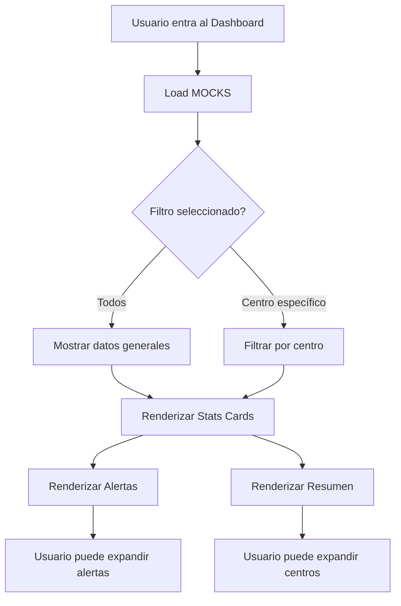

# 🎨 Dashboard de Turnos TimeNow - Rediseño UI

> Documento de arquitectura visual y guía de implementación
> **Status**: 🚧 En desarrollo | **Versión**: 1.0 | **Fecha**: 2025-11-12

---

## 📐 Wireframe & Estructura Visual

```
┌─────────────────────────────────────────────────────────────┐
│  HEADER                                                      │
│  ┌──────────────────────────┐        ┌──────────────────┐  │
│  │ Gestión de Turnos        │        │  [Nuevo Turno]  │  │
│  │ Organiza turnos rotativos│        └──────────────────┘  │
│  └──────────────────────────┘                               │
│                                                              │
│  [Dashboard] [Cuadrante] [Plantillas] [Configuración]       │
│                                                              │
├─────────────────────────────────────────────────────────────┤
│  FILTER BAR (compacta)                                       │
│  Centro: [Dropdown ▼]  Período: [●Semana] [○Mes]           │
├─────────────────────────────────────────────────────────────┤
│  STATS CARDS (Grid 4 columnas)                             │
│  ┌─────────┐ ┌─────────┐ ┌─────────┐ ┌─────────┐        │
│  │ 📊  34  │ │ ⚠️  67% │ │ 👥  12  │ │ ⏱  240h │        │
│  │ Turnos  │ │ Cover.  │ │ Sin     │ │ Horas   │        │
│  │ ●───◯   │ │ ●──◯    │ │ asignar │ │ ●───◯   │        │
│  └─────────┘ └─────────┘ └─────────┘ └─────────┘        │
├─────────────────────────────────────────────────────────────┤
│  2-COLUMN LAYOUT                                            │
│  ┌──────────────────────┐  ┌──────────────────────┐      │
│  │ ⚠️ REQUIEREN ATENCIÓN │  │ 📊 RESUMEN POR CENTRO│      │
│  │                       │  │                       │      │
│  │ [!] Conflictos       │  │ ▶ Centro Madrid      │      │
│  │     3 empleados      │  │   ████░░ 67%        │      │
│  │     Semana 10-16 Nov │  │   3 avisos          │      │
│  │                       │  │                       │      │
│  │ [!] Cobertura baja   │  │ ▶ Centro Barcelona   │      │
│  │     Zona Recepción   │  │   ██████ 85%        │      │
│  │                       │  │   1 aviso           │      │
│  │                       │  │                       │      │
│  │ [Ver más →]          │  │ [Ver más →]          │      │
│  └──────────────────────┘  └──────────────────────┘      │
└─────────────────────────────────────────────────────────────┘
```

---

## 🎨 Sistema de Diseño

### Paleta de Colores

```css
/* Marca TimeNow */
--primary: #7b3eff; /* Morado corporativo */
--primary-hover: #6929e8; /* Hover state */
--primary-light: #f5f3ff; /* Backgrounds */

/* Grises (Base slate) */
--background: #ffffff;
--card: #ffffff;
--muted: #f8fafc; /* slate-50 */
--border: #e2e8f0; /* slate-200 */
--muted-foreground: #64748b; /* slate-500 */
--foreground: #0f172a; /* slate-900 */

/* Estados */
--error: #fef2f2; /* red-50 bg */
--error-foreground: #dc2626; /* red-600 */
--warning: #fff7ed; /* amber-50 bg */
--warning-foreground: #ea580c; /* amber-600 */
--success: #ecfdf5; /* emerald-50 bg */
--success-foreground: #059669; /* emerald-600 */
```

### Tipografía

```typescript
// Jerarquía de tamaños
{
  "h1": "text-3xl font-bold",              // 30px - Título principal
  "h2": "text-2xl font-semibold",          // 24px - Secciones
  "h3": "text-xl font-semibold",           // 20px - Subsecciones
  "subtitle": "text-sm text-muted-foreground", // 14px - Subtítulos
  "kpi": "text-4xl font-display",          // 36px - Números grandes
  "body": "text-sm",                       // 14px - Texto normal
  "caption": "text-xs text-muted-foreground" // 12px - Etiquetas
}
```

### Espaciado y Layout

```typescript
// Sistema de espaciado
{
  "gap-main": "gap-6",           // 24px - Entre secciones principales
  "gap-card": "gap-4",           // 16px - Dentro de cards
  "gap-elements": "gap-2",       // 8px - Entre elementos pequeños
  "padding-card": "p-5",         // 20px - Padding de cards
  "padding-filter": "p-3",       // 12px - Padding compacto
  "border-radius": "rounded-xl"  // 12px - Bordes redondeados
}

// Grid responsivo
{
  "stats": "grid-cols-1 md:grid-cols-2 xl:grid-cols-4",
  "content": "grid-cols-1 @4xl/main:grid-cols-2"
}
```

### Componentes Base

```typescript
// Card estándar
<Card className="rounded-xl border-slate-200 shadow-sm">
  <CardHeader className="p-5 pb-3">
    <CardTitle className="text-xl font-semibold">Título</CardTitle>
    <CardDescription className="text-sm text-muted-foreground">
      Descripción
    </CardDescription>
  </CardHeader>
  <CardContent className="p-5 pt-0">
    {/* Contenido */}
  </CardContent>
</Card>

// Stat Card
<Card className="rounded-xl border-slate-200 shadow-sm hover:shadow-md transition-shadow">
  <CardContent className="p-5">
    <div className="flex items-center gap-3">
      <div className="rounded-full bg-primary/10 p-3">
        <Icon className="size-5 text-primary" />
      </div>
      <div>
        <p className="text-4xl font-display">{value}</p>
        <p className="text-sm text-muted-foreground">{label}</p>
      </div>
    </div>
    {/* Mini chart */}
  </CardContent>
</Card>

// Alert Card
<Card className="rounded-xl border-red-200 bg-red-50 shadow-sm">
  <CardContent className="p-4">
    <div className="flex gap-3">
      <div className="rounded-full bg-red-100 p-2">
        <AlertCircle className="size-4 text-red-600" />
      </div>
      <div className="flex-1">
        <p className="text-sm font-semibold">Título del aviso</p>
        <p className="text-xs text-muted-foreground">Descripción</p>
      </div>
    </div>
  </CardContent>
</Card>
```

---

## 📦 Estructura de Componentes

### 1. `dashboard-header.tsx`

**Props**: Ninguna (usa estado global del store)

**Responsabilidad**:

- Renderizar título y subtítulo
- Segmented control para tabs
- Botón de acción principal

**Estilo**:

```tsx
<div className="flex items-center justify-between">
  <div>
    <h1 className="text-3xl font-bold">Gestión de Turnos</h1>
    <p className="text-sm text-muted-foreground mt-1">
      Organiza los turnos rotativos de tu equipo
    </p>
  </div>
  <Button className="bg-primary hover:bg-primary-hover">
    <Plus className="mr-2 h-4 w-4" />
    Nuevo Turno
  </Button>
</div>

<Tabs defaultValue="dashboard">
  <TabsList className="bg-muted p-1 rounded-lg">
    <TabsTrigger value="dashboard">Dashboard</TabsTrigger>
    <TabsTrigger value="calendar">Cuadrante</TabsTrigger>
    <TabsTrigger value="templates">Plantillas</TabsTrigger>
    <TabsTrigger value="config">Configuración</TabsTrigger>
  </TabsList>
</Tabs>
```

---

### 2. `dashboard-filter-bar.tsx`

**Props**:

```typescript
interface FilterBarProps {
  selectedCenter: string;
  onCenterChange: (id: string) => void;
  periodType: "week" | "month";
  onPeriodChange: (type: "week" | "month") => void;
}
```

**Estilo**:

```tsx
<Card className="rounded-xl border-slate-200 shadow-sm">
  <CardContent className="p-3">
    <div className="flex flex-wrap items-center gap-4">
      {/* Centro */}
      <div className="flex items-center gap-2">
        <label className="text-muted-foreground text-sm font-medium">Centro:</label>
        <Select value={selectedCenter} onValueChange={onCenterChange}>
          <SelectTrigger className="w-[200px]">
            <SelectValue />
          </SelectTrigger>
        </Select>
      </div>

      {/* Período */}
      <div className="flex items-center gap-2">
        <label className="text-muted-foreground text-sm font-medium">Período:</label>
        <ToggleGroup type="single" value={periodType}>
          <ToggleGroupItem value="week">Semana actual</ToggleGroupItem>
          <ToggleGroupItem value="month">Mes actual</ToggleGroupItem>
        </ToggleGroup>
      </div>
    </div>
  </CardContent>
</Card>
```

---

### 3. `dashboard-stats-cards.tsx`

**Props**:

```typescript
interface StatsCardsProps {
  stats: {
    totalShifts: number;
    coverage: number;
    employeesWithoutShifts: number;
    hoursAssigned: number;
    hoursContracted: number;
  };
  isLoading?: boolean;
}
```

**4 Cards**:

1. **Estado de Turnos** - Total + badge de estado
2. **Cobertura** - Porcentaje + gráfico circular
3. **Sin Asignar** - Empleados sin turno + indicador
4. **Horas** - Progreso de horas asignadas

**Diseño Individual**:

```tsx
<Card className="rounded-xl border-slate-200 shadow-sm transition-shadow hover:shadow-md">
  <CardContent className="p-5">
    <div className="flex items-start justify-between">
      {/* Icono */}
      <div className="bg-primary/10 rounded-full p-3">
        <Calendar className="text-primary size-6" />
      </div>

      {/* Mini chart opcional */}
      <div className="size-12">
        <RadialChart value={75} />
      </div>
    </div>

    {/* KPI */}
    <div className="mt-4">
      <p className="font-display text-4xl font-bold">34</p>
      <p className="text-muted-foreground mt-1 text-sm">Turnos asignados</p>
    </div>

    {/* Badges opcionales */}
    <div className="mt-3 flex gap-2">
      <Badge variant="outline" className="text-xs">
        3 borradores
      </Badge>
    </div>
  </CardContent>
</Card>
```

---

### 4. `dashboard-critical-alerts.tsx`

**Props**:

```typescript
interface CriticalAlertsProps {
  alerts: Array<{
    id: string;
    type: "conflict" | "coverage" | "unpublished";
    severity: "error" | "warning" | "info";
    title: string;
    description: string;
    affectedEmployees: string[];
    weekDisplay: string;
  }>;
  isLoading?: boolean;
}
```

**Diseño**:

```tsx
<Card className="rounded-xl border-slate-200 shadow-sm">
  <CardHeader className="p-5 pb-3">
    <div className="flex items-center justify-between">
      <div>
        <CardTitle className="flex items-center gap-2 text-xl font-semibold">
          <AlertTriangle className="size-5 text-red-600" />
          Requieren Atención
        </CardTitle>
        <CardDescription className="text-muted-foreground mt-1 text-sm">3 avisos críticos detectados</CardDescription>
      </div>
      <Badge variant="destructive" className="text-xs">
        3 críticos
      </Badge>
    </div>
  </CardHeader>

  <CardContent className="p-5 pt-0">
    <div className="space-y-3">
      {alerts.map((alert) => (
        <Card className="rounded-lg border-red-200 bg-red-50 shadow-none">
          <CardContent className="p-4">
            <div className="flex gap-3">
              <div className="shrink-0 rounded-full bg-red-100 p-2">
                <AlertCircle className="size-4 text-red-600" />
              </div>
              <div className="flex-1 space-y-2">
                <div>
                  <p className="text-sm font-semibold">{alert.title}</p>
                  <p className="text-muted-foreground text-xs">{alert.description}</p>
                </div>

                {/* Week display prominente */}
                <div className="flex items-center gap-2 rounded-md border border-red-100 bg-white/50 px-3 py-1.5">
                  <Calendar className="text-primary size-3" />
                  <span className="text-xs font-medium">{alert.weekDisplay}</span>
                </div>

                {/* Empleados afectados */}
                <Collapsible>
                  <CollapsibleTrigger className="text-muted-foreground hover:text-foreground text-xs">
                    {alert.affectedEmployees.length} empleados afectados ▼
                  </CollapsibleTrigger>
                  <CollapsibleContent>
                    <div className="mt-2 flex flex-wrap gap-1">
                      {alert.affectedEmployees.map((name) => (
                        <Badge variant="outline" className="text-xs">
                          {name}
                        </Badge>
                      ))}
                    </div>
                  </CollapsibleContent>
                </Collapsible>
              </div>
            </div>
          </CardContent>
        </Card>
      ))}
    </div>

    {/* Footer */}
    <div className="mt-4 text-right">
      <Button variant="ghost" size="sm" className="text-xs">
        Ver más →
      </Button>
    </div>
  </CardContent>
</Card>
```

---

### 5. `dashboard-center-summary.tsx`

**Props**:

```typescript
interface CenterSummaryProps {
  centers: Array<{
    id: string;
    name: string;
    totalShifts: number;
    coverage: number;
    alerts: number;
    zones: Array<{
      name: string;
      coverage: number;
    }>;
  }>;
  isLoading?: boolean;
}
```

**Diseño**:

```tsx
<Card className="rounded-xl border-slate-200 shadow-sm">
  <CardHeader className="p-5 pb-3">
    <CardTitle className="text-xl font-semibold">📊 Resumen por Centro</CardTitle>
    <CardDescription className="text-muted-foreground mt-1 text-sm">
      Estadísticas de cada lugar de trabajo
    </CardDescription>
  </CardHeader>

  <CardContent className="p-5 pt-0">
    <Accordion type="multiple" className="space-y-2">
      {centers.map((center) => (
        <AccordionItem value={center.id} className="rounded-lg border">
          <AccordionTrigger className="px-4 py-3 hover:no-underline">
            <div className="flex w-full items-center justify-between pr-4">
              {/* Info */}
              <div className="flex items-center gap-3">
                <div className="bg-primary/10 rounded-full p-2">
                  <Building2 className="text-primary size-4" />
                </div>
                <div className="text-left">
                  <p className="text-sm font-semibold">{center.name}</p>
                  <p className="text-muted-foreground text-xs">{center.totalShifts} turnos</p>
                </div>
              </div>

              {/* Badges */}
              <div className="flex items-center gap-2">
                {/* Barra de cobertura */}
                <div className="flex items-center gap-2">
                  <div className="h-2 w-20 overflow-hidden rounded-full bg-slate-100">
                    <div className="bg-primary h-full rounded-full" style={{ width: `${center.coverage}%` }} />
                  </div>
                  <span className="text-xs font-medium">{center.coverage}%</span>
                </div>

                {/* Alertas */}
                {center.alerts > 0 && (
                  <Badge variant="destructive" className="text-xs">
                    {center.alerts} avisos
                  </Badge>
                )}
              </div>
            </div>
          </AccordionTrigger>

          <AccordionContent className="px-4 pb-3">
            <div className="mt-2 space-y-2">
              {center.zones.map((zone) => (
                <div className="bg-muted flex items-center justify-between rounded-md p-2">
                  <span className="text-xs font-medium">{zone.name}</span>
                  <div className="flex items-center gap-2">
                    <div className="h-1.5 w-16 overflow-hidden rounded-full bg-slate-200">
                      <div className="bg-primary h-full rounded-full" style={{ width: `${zone.coverage}%` }} />
                    </div>
                    <span className="text-muted-foreground text-xs">{zone.coverage}%</span>
                  </div>
                </div>
              ))}
            </div>
          </AccordionContent>
        </AccordionItem>
      ))}
    </Accordion>

    {/* Footer */}
    <div className="mt-4 text-right">
      <Button variant="ghost" size="sm" className="text-xs">
        Ver más →
      </Button>
    </div>
  </CardContent>
</Card>
```

---

## 🔄 Flujo de Interacción



---

## 📊 Datos MOCK

### Estructura de datos en `dashboard-mock-data.ts`

```typescript
export const MOCK_STATS = {
  totalShifts: 34,
  draftShifts: 3,
  publishedShifts: 31,
  coverage: 67,
  employeesWithoutShifts: 12,
  totalEmployees: 45,
  hoursAssigned: 240,
  hoursContracted: 320,
};

export const MOCK_ALERTS = [
  {
    id: "alert-1",
    type: "conflict",
    severity: "error",
    title: "3 conflictos de horario",
    description: "Empleados con turnos superpuestos",
    affectedEmployees: ["Ana García", "Carlos López", "María Sánchez"],
    weekDisplay: "Semana 10-16 Nov 2025",
  },
  // ... más alertas
];

export const MOCK_CENTERS = [
  {
    id: "center-1",
    name: "Centro Madrid",
    totalShifts: 18,
    coverage: 67,
    alerts: 3,
    zones: [
      { name: "Recepción", coverage: 45 },
      { name: "Planta Baja", coverage: 80 },
      { name: "Piso 1", coverage: 75 },
    ],
  },
  // ... más centros
];
```

---

## ✅ Checklist de Implementación

- [ ] Crear documento de arquitectura visual
- [ ] Crear archivo de datos MOCK
- [ ] Implementar `dashboard-header.tsx`
- [ ] Implementar `dashboard-filter-bar.tsx`
- [ ] Implementar `dashboard-stats-cards.tsx`
- [ ] Implementar `dashboard-critical-alerts.tsx`
- [ ] Implementar `dashboard-center-summary.tsx`
- [ ] Integrar componentes en `shifts-dashboard.tsx`
- [ ] Actualizar `page.tsx` con nueva estructura
- [ ] Probar responsive en móvil, tablet y desktop
- [ ] Validar accesibilidad (contraste, ARIA labels)

---

## 📱 Responsive Breakpoints

```typescript
// Mobile first approach
{
  "sm": "640px",   // 1 columna stats
  "md": "768px",   // 2 columnas stats
  "xl": "1280px",  // 4 columnas stats
  "@4xl/main": "1536px" // 2 columnas content layout
}
```

---

## 🎯 Métricas de Éxito

- ✅ Todas las cards tienen shadow-sm y bordes suaves
- ✅ Espaciado consistente (gap-4, gap-6)
- ✅ Colores suaves no saturados
- ✅ Tipografía equilibrada y legible
- ✅ Jerarquía visual clara
- ✅ Interacciones suaves (hover, transitions)
- ✅ 100% datos MOCK (sin APIs)

---

**Última actualización**: 2025-11-12
**Autor**: TimeNow Design System
**Versión**: 1.0
